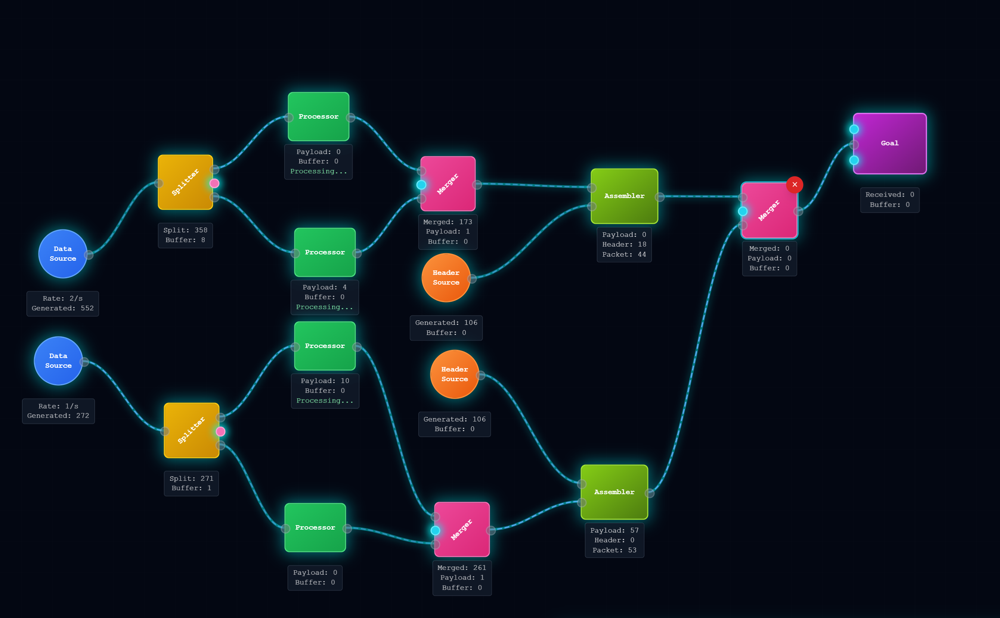

# Signal Game

Hey! Das hier ist ein kleines, aber feines Factory-/Automatisierungs-Game, gebaut mit React + Vite. Du kannst Datenquellen, Prozessoren, Splitter, Merger und mehr auf ein Spielfeld ziehen, verbinden und so deine eigene kleine Datenfabrik bauen. Ziel: Möglichst effizient Datenpakete produzieren!

## Features
- Drag & Drop Maschinen aufs Spielfeld
- Verbindungen zwischen Maschinen ziehen (Splitter, Merger, usw.)
- Live-Stats zu allen Maschinen
- Ressourcen- und Produktionsübersicht im HUD
- Simulierte Datenflüsse und Verarbeitung

## Screenshot

Hier kannst du einen Screenshot einfügen:



*(Tipp: Ersetze das Bild durch einen echten Screenshot deines Spiels!)*

## Setup & Installation

1. **Repo klonen:**
   ```bash
   git clone <dein-repo-link>
   cd signal-game
   ```
2. **Abhängigkeiten installieren:**
   ```bash
   npm install
   ```
   (Du brauchst Node.js >= 18)

3. **Dev-Server starten:**
   ```bash
   npm run dev
   ```
   Dann öffnet sich das Game unter [http://localhost:5173](http://localhost:5173) (oder was Vite dir ausspuckt).

## Packages/Requirements
- React
- Vite
- TailwindCSS (für das Styling)

Alles was du brauchst, ist schon in der `package.json` – einfach `npm install` reicht.

## Mitmachen/Feedback

Wenn du Bock hast, was zu verbessern oder nen Bug findest: Pull Requests und Issues sind willkommen! Einfach forken, branch machen, loslegen.

Viel Spaß beim Basteln! 🚀
